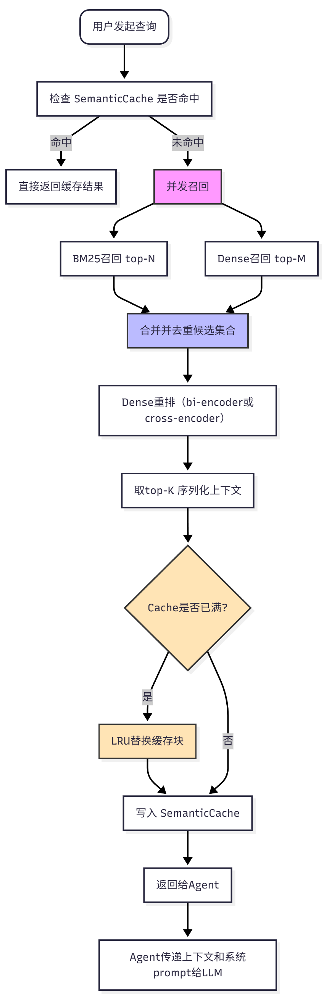

# 🧠FlowCacheRag---- RAG Agent with Semantic Cache (LRU + Embedding Similarity)

> 🚀 A lightweight **LangChain** integrating **dynamic feature-aware LRU caching**, **vector retrieval (RAG)**,and retrieval-augmented generation (RAG) — optimized for **efficient semantic reuse,** and **low-latency context retrieval.**.


---

## 🌟 Features

✅ **RAG-Enhanced Agent**
- Uses `InMemoryVectorStore` for semantic retrieval from real blog posts.  
- Embeds and splits large documents using `RecursiveCharacterTextSplitter`.  

✅ **Custom Semantic Cache**
- LRU (Least Recently Used) + cosine similarity based caching.  
- Intelligent cache hit detection (`threshold` adjustable).  
- Reduces redundant embedding + retrieval cost.  

✅ **LangGraph Integration**
- Built with `InMemorySaver` for memory checkpointing.  
- Supports *multi-turn* conversations with persistent context.  

✅ **Structured Output**
- Responses follow a strict schema (`ResponseFormat`) for clean, type-safe results.  

✅ **Extensible Tools**
- `retrieve_context` — Hybrid retrieval with cache-first logic.  
- `search_web` — Mock search tool (can be replaced by Tavily / Serper / DuckDuckGo).  

✅ **Professional Design**
- Modular architecture.  
- Type annotations + dataclasses for clear schema control.  
- Compatible with `gpt-4o-mini` or higher.  

---

## 🧩 System Architecture

```mermaid
graph TD

A[User Query] -->|Input| B[LangGraph Agent]
B -->|Tool Invocation| C[Semantic Cache]
C -->|Hit| D[Return Cached Context]
C -->|Miss| E[VectorStore (RAG)]
E --> F[OpenAI Embeddings]
F -->|New Docs| G[Cache Add + Response]
B -->|Structured Output| H[ResponseFormat]

```  

## 🧱 Project Structure
.
├── main.py                    # 🚀 Entry point (agent loop)
├── .env                       # Environment variables (e.g. OPENAI_API_KEY)
├── requirements.txt            # Dependencies
├── README.md                   # This file
└── utils/
    ├── semantic_cache.py       # Custom LRU + embedding cache
    └── loaders.py              # WebBaseLoader for external sources

## ⚙️ Installation

# 1️⃣ Clone the repo
git clone https://github.com/yourusername/langgraph-rag-agent.git
cd langgraph-rag-agent

# 2️⃣ Create environment
python -m venv venv
source venv/bin/activate   # (Windows: venv\Scripts\activate)

# 3️⃣ Install dependencies
pip install -r requirements.txt

# 4️⃣ Set your environment variables
echo "OPENAI_API_KEY=sk-xxxxxx" > .env

##📦 Core Components

| Component                        | Description                                          |
| -------------------------------- | ---------------------------------------------------- |
| `SemanticCache`                  | LRU cache based on cosine similarity of embeddings   |
| `InMemoryVectorStore`            | Vector database storing split documents              |
| `WebBaseLoader`                  | Crawls specified blog content for retrieval          |
| `RecursiveCharacterTextSplitter` | Splits long docs into semantic chunks                |
| `ResponseFormat`                 | Dataclass enforcing structured LLM output            |
| `InMemorySaver`                  | LangGraph memory checkpoint for conversation threads |

## 🧩 Example: SemanticCache Visualization

cache.stats()
# {'capacity': 128, 'entries': 7, 'threshold': 0.3}
On cache hit:
[Cache] HIT (score=0.91) for query: "LangChain memory"...

## 🧰 Dependencies

| Library            | Version | Purpose                      |
| ------------------ | ------- | ---------------------------- |
| `langchain`        | latest  | Agent & Tool orchestration   |
| `langgraph`        | latest  | Graph-based agent execution  |
| `langchain_openai` | latest  | Embeddings + Chat models     |
| `numpy`            | ≥1.25   | Vector math                  |
| `beautifulsoup4`   | ≥4.12   | Web parsing                  |
| `dotenv`           | ≥1.0    | Environment variable loading |

## 📸 Preview
